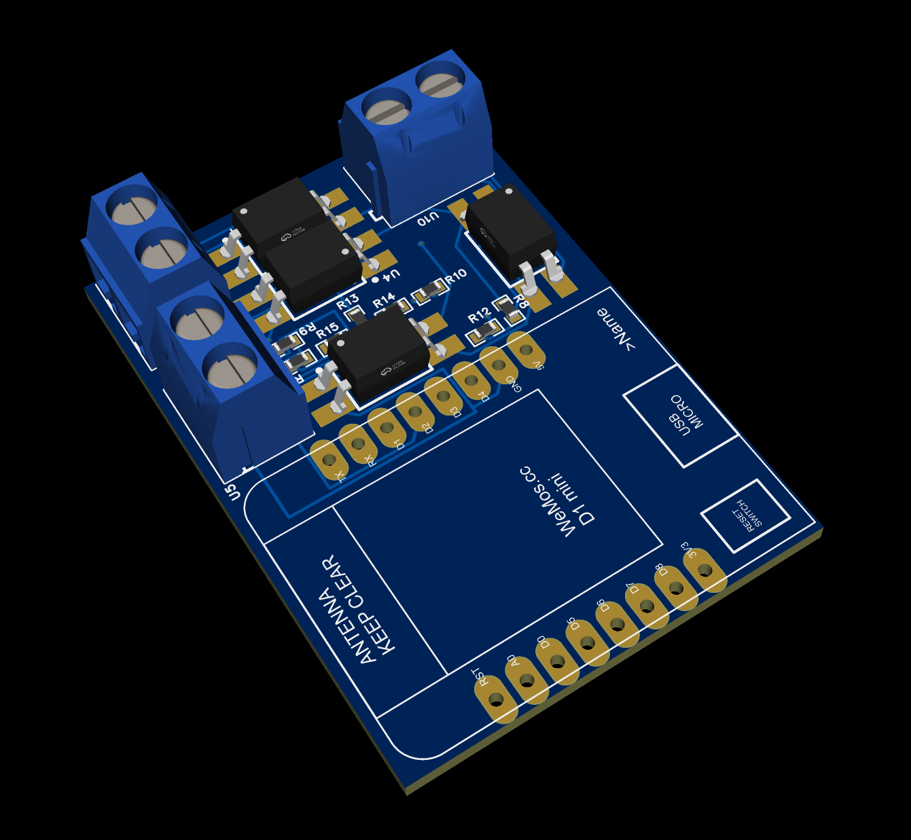
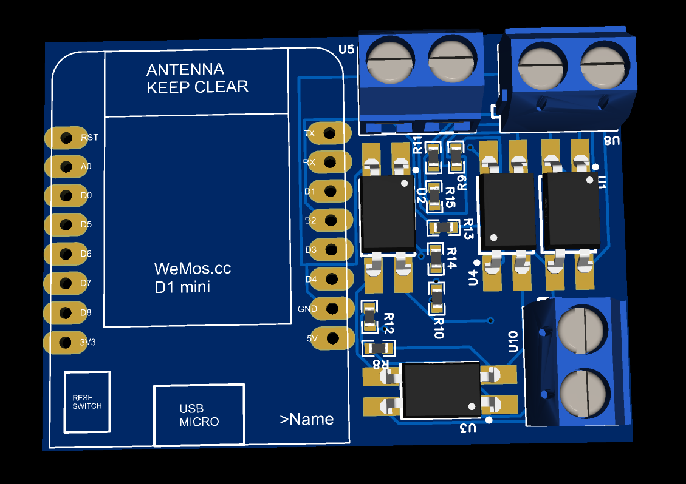
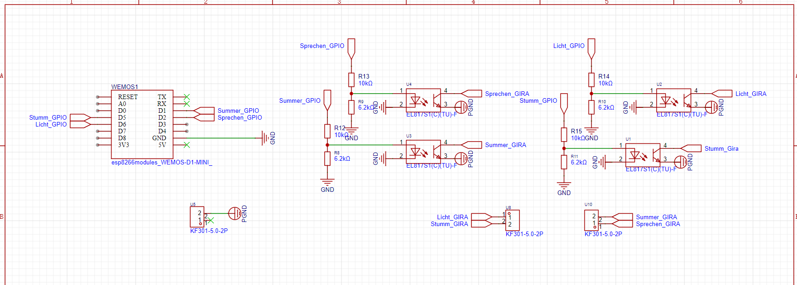
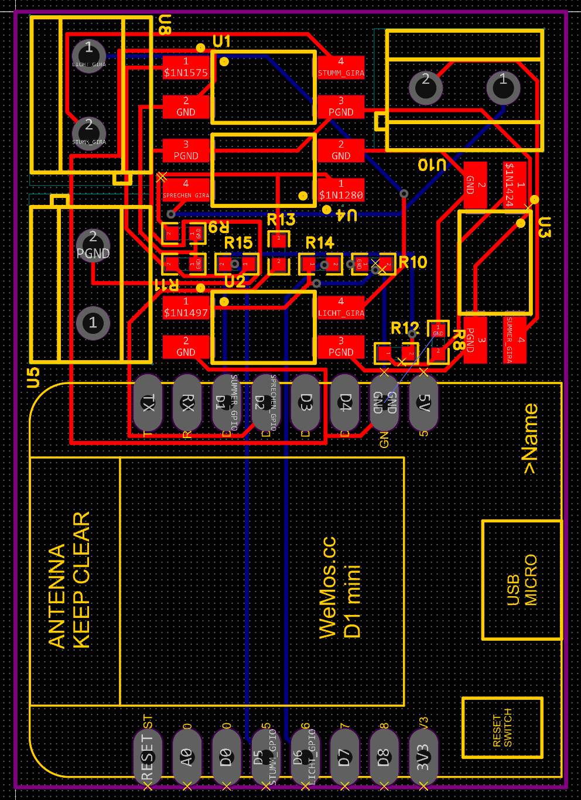

# PCB

Please note that some modifications are required to get this PCB working. The PCB is designed to be used with a ESP8266 D1Mini NodeMCU and a Gira Doorbell.  
  
If you have the exact same doorbell as described in the [README.md](../README.md) you will not have to buy any resistors for the pcb. In that case you have to bridge the contacts of R12, R13, R14 and R15. This should do the trick.  
  
When using a different doorbell you will have to measure the voltage of the doorbell and calculate the resistors accordingly. Note that the optocouplers are rated for a maximum of 6V input and 35V output.

The PCB looks like this:

The schematics:

The PCB layout:

_Note: These images are not the newest. For the actuall latest view of the project either open the [project file](./Project.epro) in EasyEDA or the [gerber files](./Gerber_new-version-5v-onboard.zip) in a gerber viewer._