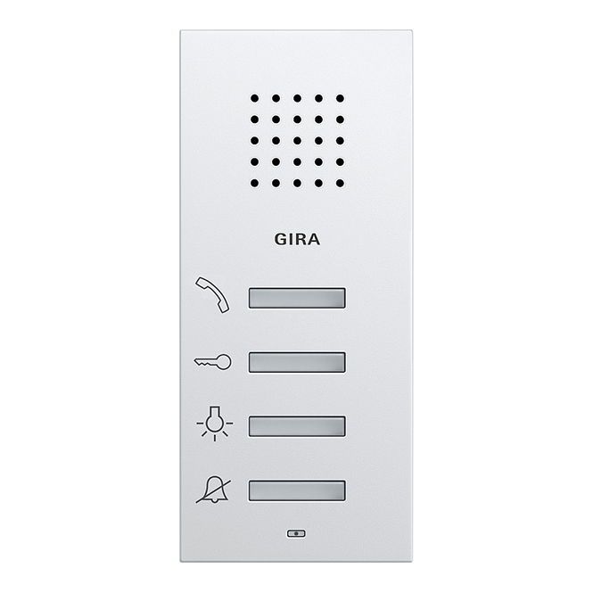
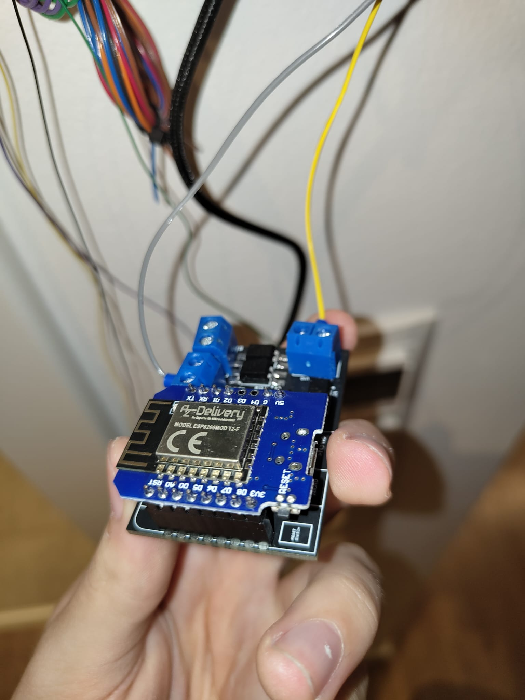
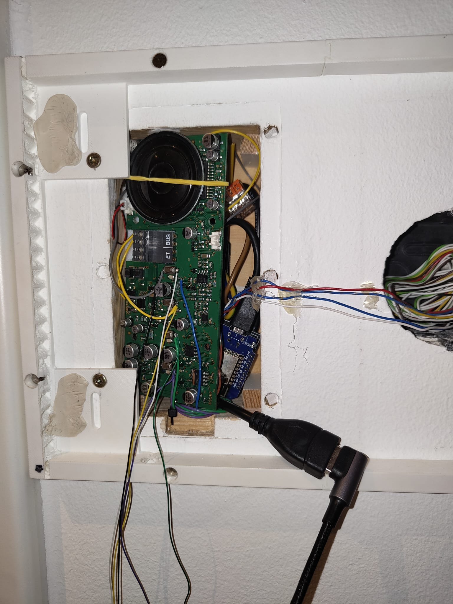
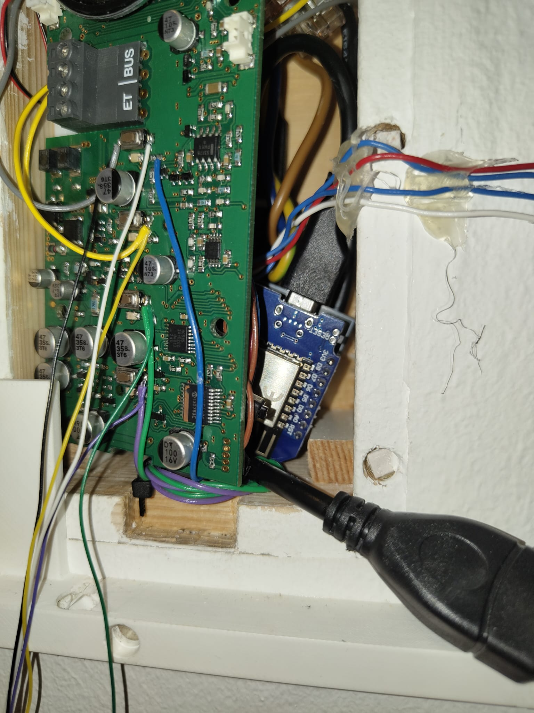

# Smart-Home-Doorbell
 
A little soft- and hardware package for "smartifying" your Gira Doorbell. The Hardware is based on a ESP8266 D1Mini NodeMCU with an ESPHome image. 
The configuration can be found in the [esphome.yaml](esphome.yaml) file.

## Hardware

- [ESP8266 D1Mini NodeMCU](https://www.amazon.de/dp/B0754W6Z2F?ref=ppx_yo2ov_dt_b_fed_asin_title)
- [Gira Doorbell](https://www.elektroland24.de/haustechnik/tuersprechanlagen/sprechanlagen-gira/wohnungsstation-aufputz/gira-125003-wohnungsstation-audio-aufputz-system-55.html)
- Wires (36 AWG is probably enough)
- Soldering Iron
- Soldering Tin
- ALl electronic components can be found in the EasyEDA project [here](/PCB/)

## Software

- [ESPHome](https://esphome.io/)  
I also used Home Assistant to integrate the doorbell into my smart home. 

## Connecting to the Gira Doorbell

For connecting the custom pcb to the Gira Doorbell you will have to open the doorbell and connect the wires to the contacts of the doorbell. The color coding of the wires is as follows:  

| Color | Label |
|-------|-------|
| Gray   | AGND     |
| Yellow | Opener     |
| Green | Light toggle     |
| Purple  | Mute     |

The left side of the push buttons all connect to GND. Thats why only one of the contacts is connected to the pcb. Also the GND of the Gira PCB is isolted from the GND of the ESP8266. The GND label for the "Gira GND" is AGND in the PCB design.

The connections should look like this:

## Connecting the ESP8266

I did not use the mute and light toggle functions, so I only connected the AGND and Opener contacts in the screw terminal. The speak funtion can also be used, but I did not even solder a wire as it doesn't make sense in my case.

After more investigation on the layout of the Gira PCB it should be possible to connect the ESP8266 directly to the Gira PCB without the need for an external power supply. The Gira PCB has a 5V output on the soldered blue wire below the first button next to the resistor of the indicator led for that button. as a GND the gray wire could be used. This would make the installation even cleaner.

The possibility for that is already included in the newest gerber files. The ESP8266 can be connected to the Gira PCB with the empty screw terminal slot.

## PCB

For more information on the PCB please refer to the [PCB](/PCB/) folder.

## Final Installation

The final installation could look like this:

_Note: No images are the newest. For the actual latest view of the project either open the [project file](PCB/Project.epro) in EasyEDA or the [gerber files](PCB/Gerber_new-version-5v-onboard.zip) in a gerber viewer._